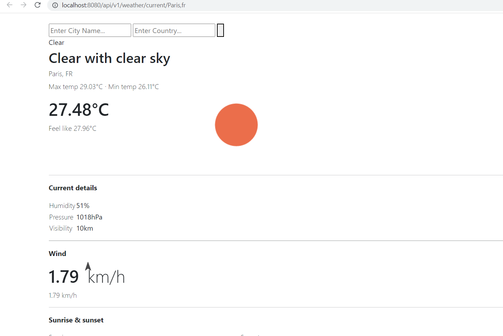
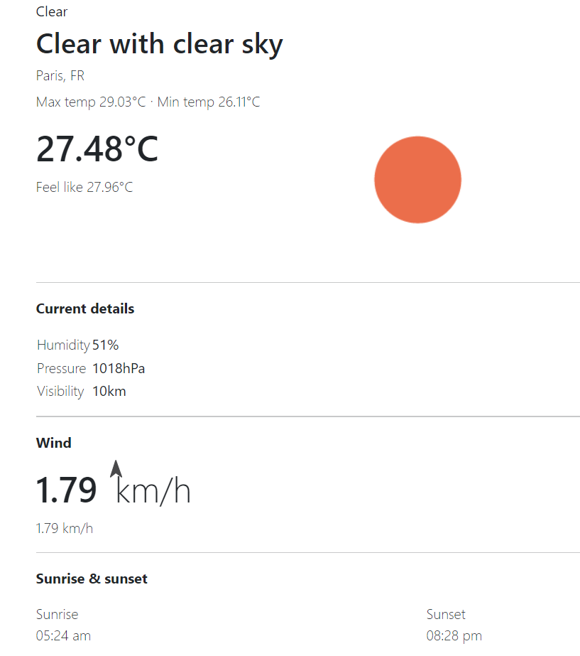
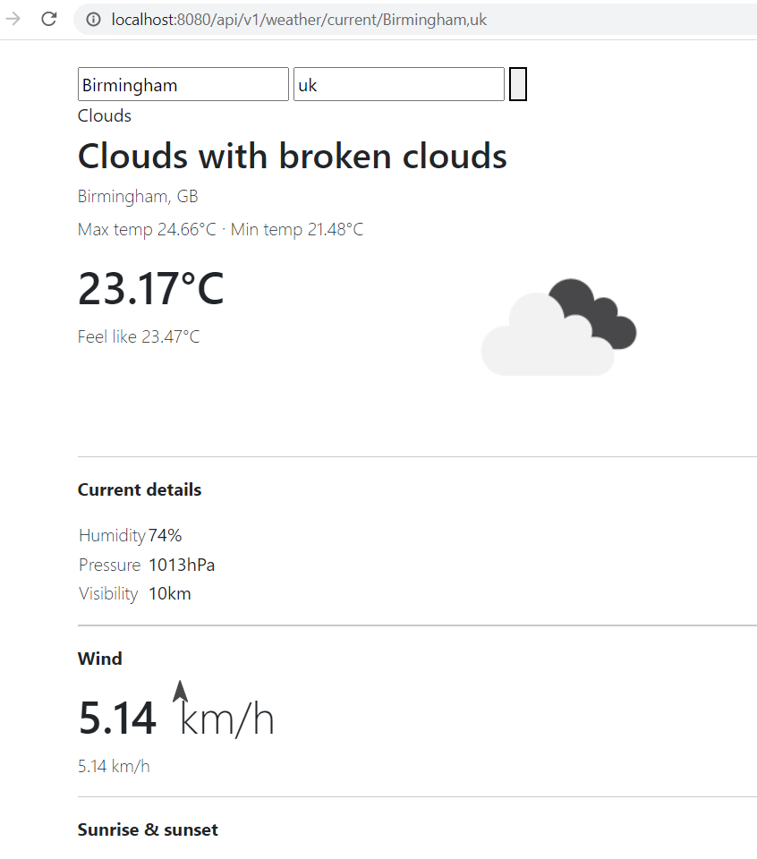

# WEATHER APP
## Tech Used:
- Java Springboot - backend
- PostgresSQL Database
- HTML & CSS - frontend
- OpenWeatherAPI

## Overview:
1. User selects the city name & country code.
2. Using OpenWeatherAPI, retrieves data about the weather for this city for today's date.
3. Displays this information onto: http://localhost:8080/api/v1/weather/current/{cityName},{countryCode}
4. When the Java Spring boot app starts, retrieves weather data for the most common cities (e.g. London, Paris, Detroit) and stores this info onto an in-memory Postresql database (for quick read access)

## Examples:
Paris, Fr

Birmingham, UK

## How to set up:
1. Insert your specific OpenWeatherAPI key into the application.properties file in the resources folder.
2. Start up application and go to http://localhost:8080/api/v1/weather/current/{cityName},{countryCode}